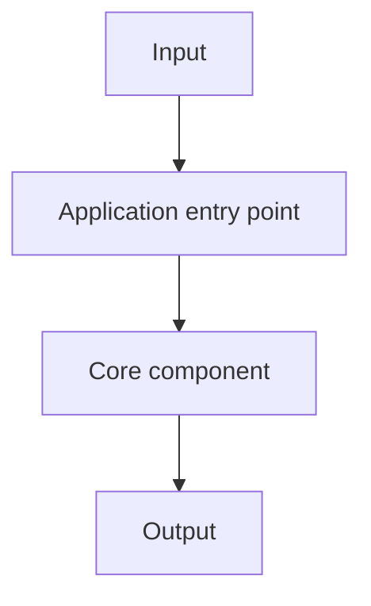
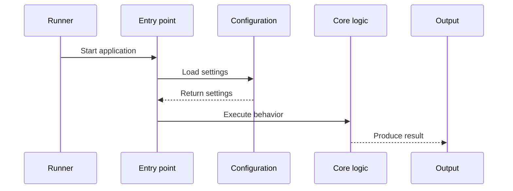

# Architecture

## Purpose

[State the purpose only when supported by repository evidence. Otherwise use TBD.]

## Components

| Component | Responsibility | Evidence |
| --- | --- | --- |
| `[path or module]` | [Observed responsibility] | `[source path]` |

_Evidence note: replace every node and relationship with repository-backed components._

## Runtime Flow

_Evidence note: replace participants and messages with observed runtime behavior._

## Dependencies and Integrations

- Runtime dependencies: [Verified dependencies or TBD]
- External services: [Verified services or None evidenced]

## Known Gaps

- [Open question, contradiction, or TBD item]
