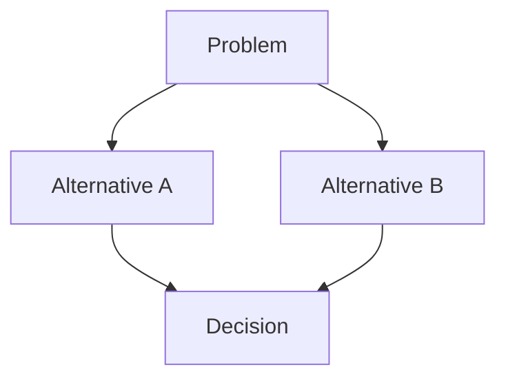

# Architectural Decisions

## ADR-001: [Decision Title]

- Date: [YYYY-MM-DD or TBD]
- Status: [Proposed, Accepted, Rejected, Deprecated, or TBD]

### Context

[Describe the evidenced problem and constraints.]

### Decision

[Describe the chosen approach, or mark it as TBD.]

### Alternatives

- [Alternative and reason it was not selected]

### Consequences

- [Benefit, cost, risk, or operational impact]

### Evidence

- `[Source path or issue reference]`

_Remove the diagram when no competing alternatives are evidenced._
