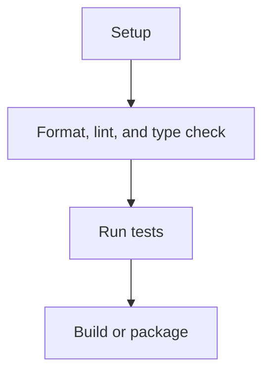

# Development Guide

## Prerequisites

- [Runtime and version]
- [Required tools]

## Setup and Configuration

```text
[Verified setup command]
```

| Variable | Meaning | Default |
| --- | --- | --- |
| `[VARIABLE]` | [Observed meaning] | [Observed default or TBD] |

## Common Commands

| Command | Purpose |
| --- | --- |
| `[command]` | [Purpose] |

## Task Flow



_Evidence note: use only commands and task dependencies found in the repository._

## Troubleshooting

- [Observed failure and supported remedy]

## Platform Notes

[Document verified platform differences. Use TBD when not evidenced.]
