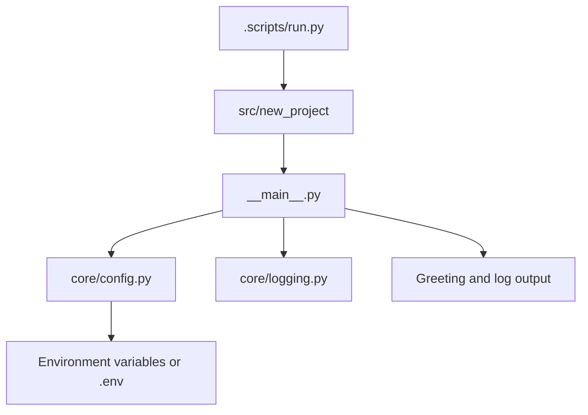
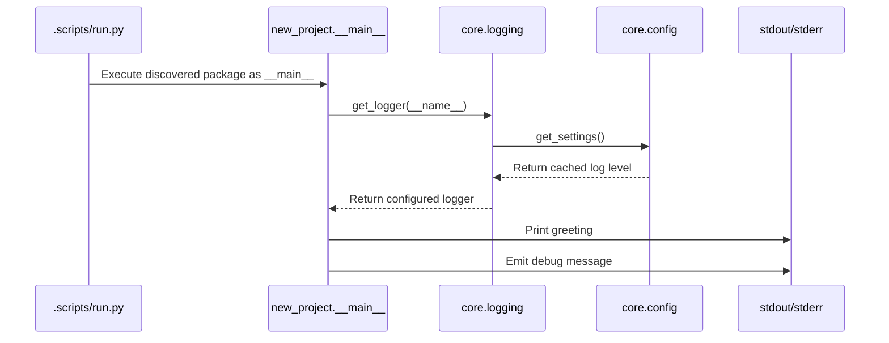

# Architecture

## Purpose

`new-project` is a Python project template with a runnable package entry point,
environment-backed settings, configurable logging, automated validation, and an
optional PyInstaller executable build. No business domain or external service
is evidenced in the repository.

## Components

| Component | Responsibility | Evidence |
| --- | --- | --- |
| `.scripts/run.py` | Finds the first package under `src/` and runs it as `__main__`. | `.scripts/run.py` |
| `src/new_project/__main__.py` | Loads a logger, prints the greeting, and emits a debug message. | `src/new_project/__main__.py` |
| `src/new_project/core/config.py` | Loads cached settings from environment variables and `.env`. | `src/new_project/core/config.py` |
| `src/new_project/core/logging.py` | Configures console and optional file logging. | `src/new_project/core/logging.py` |
| `tests/test_main.py` | Verifies configured log-level behavior. | `tests/test_main.py` |
| `.scripts/build_exe.py` and `specs/app.spec` | Discover package metadata and build a console executable with PyInstaller. | `.scripts/build_exe.py`, `specs/app.spec` |

_Evidence: component names and relationships are derived from the source files
listed in the table above._

## Runtime Flow

_Evidence: `get_logger()` lazily configures logging from `get_settings()` before
`main()` writes output._

## Configuration and Logging

`Settings` reads `.env` and environment variables using Pydantic Settings. The
supported values are:

- `ENVIRONMENT`: `development`, `staging`, or `production`; default `development`.
- `DEFAULT_LOG_LEVEL`: `DEBUG`, `INFO`, `WARNING`, `ERROR`, or `CRITICAL`; default `INFO`.
- `LOG_FILE`: file path for application logs; default `logs/app.log`.

`get_settings()` caches the settings object. Logging defaults to stdout, can use
stderr, and writes to `logs/app.log` relative to the process working directory
by default. The file handler creates parent directories as needed. Calling
`configure_logging()` again replaces existing root handlers.

## Dependencies and Packaging

Runtime dependencies are `pydantic` and `pydantic-settings`. Development tools
include Ruff, Pyrefly, pytest, pytest-cov, and PyInstaller. The build metadata
targets `src/new_project`, and the PyInstaller spec includes `README.md` in the
application bundle.

## Known Gaps and Contradictions

- `pyproject.toml` contains a second `dependencies` key and a `log_level` value
	in the project table; their intended ownership should be clarified.
- Package, spec, and runner discovery select the first matching filesystem entry,
	so multiple packages or specs would make behavior order-dependent.
- Pyrefly is configured for the Windows platform even though Linux shell tooling
	is present; cross-platform type-checking behavior is unverified.
- No deployment target, external service, ownership model, or domain-specific
	architecture is documented in the repository.
