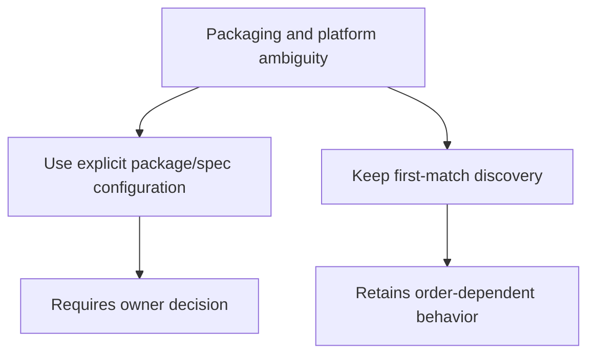

# Architectural Decisions

## ADR-001: Use a `src` Layout and `uv`-Managed Tooling

- Date: 2026-08-10 (repository history)
- Status: Accepted

### Context

The repository is a reusable Python project template and needs a predictable
source boundary, isolated environment, and repeatable development commands.

### Decision

Keep application code under `src/new_project/`, manage dependencies and command
execution with `uv`, and centralize formatting, linting, testing, and type-check
configuration in `pyproject.toml`.

### Alternatives

- A flat package layout or another environment manager could be used, but no
	repository evidence indicates that either was selected.

### Consequences

- Imports and packaging use an explicit source boundary.
- Setup and validation are reproducible through scripts and VS Code tasks.
- Contributors need Python 3.13 and `uv`.

### Evidence

- `pyproject.toml`
- `.python-version`
- `.vscode/tasks.json`
- Commit `bfc4010`

## ADR-002: Load Settings from Environment and `.env`

- Date: 2026-08-26 (commit history)
- Status: Accepted

### Context

Runtime values should be configurable without editing source code or committing
local secrets and environment overrides.

### Decision

Use Pydantic Settings with a cached `get_settings()` function. Support
`ENVIRONMENT` and `DEFAULT_LOG_LEVEL`, and ignore unknown `.env` keys.

### Consequences

- Local and deployment environments can provide configuration externally.
- Tests must clear the settings cache when changing environment variables.
- The supported configuration surface is explicit and currently small.

### Evidence

- `src/new_project/core/config.py`
- `.env_example`
- `tests/test_main.py`

## ADR-003: Keep Packaging and Discovery Issues Open

- Date: 2026-08-26
- Status: Proposed

### Context

The project currently discovers the first package or spec file at runtime and
build time. The repository also contains duplicate dependency metadata in
`pyproject.toml` and a Windows-specific Pyrefly platform setting.

### Decision

Do not silently choose a future packaging or platform policy. Track these as
open decisions until the project owner specifies whether discovery should become
explicit and which platforms must be supported.

### Alternatives

### Consequences

- Documentation remains honest about current behavior and risk.
- Builds may remain fragile when multiple packages or specs are introduced.
- A later decision can be implemented without rewriting historical ADRs.

### Evidence

- `.scripts/run.py`
- `.scripts/build_exe.py`
- `specs/app.spec`
- `pyproject.toml`
