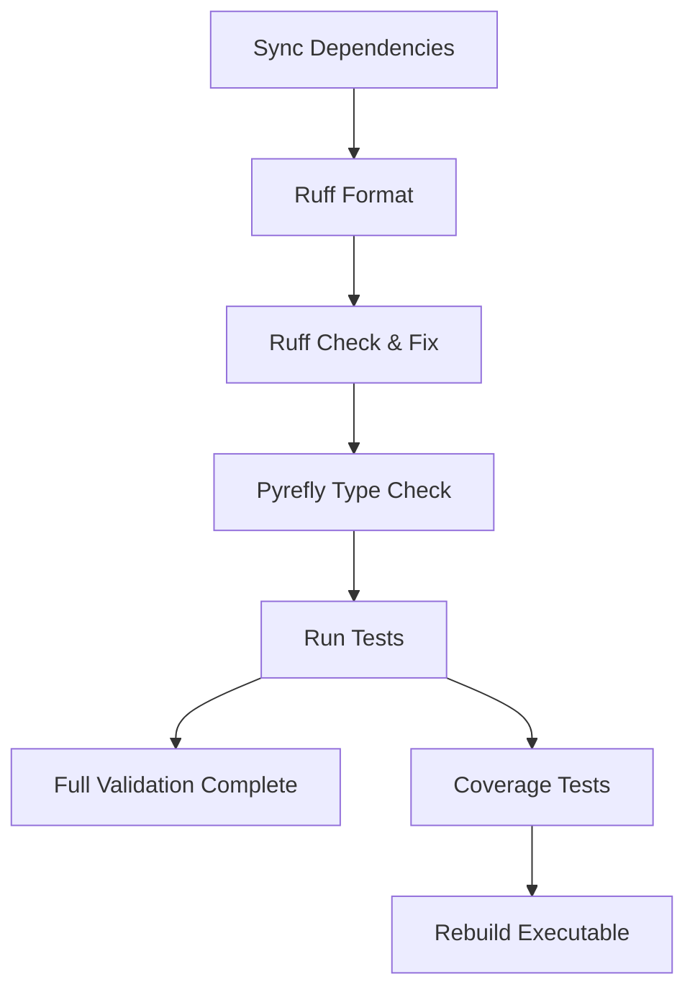

# Development Guide

## Prerequisites

- Python 3.13 or newer; `.python-version` pins Python 3.13.
- `uv` for environments, dependencies, and command execution.
- Git for repository operations.

## Setup

On Linux or macOS:

```bash
./.scripts/setup.sh
```

On Windows:

```bat
.\.scripts\setup.bat
```

The setup scripts create `.venv`, synchronize dependencies, and run the
repository's quality checks. The project also exposes `⚙️ Project Setup` and
`📦 Sync Dependencies` VS Code tasks.

## Configuration

Copy `.env_example` to `.env` when local overrides are needed. `.env` is ignored
by Git.

| Variable | Accepted values | Default |
| --- | --- | --- |
| `ENVIRONMENT` | `development`, `staging`, `production` | `development` |
| `DEFAULT_LOG_LEVEL` | `DEBUG`, `INFO`, `WARNING`, `ERROR`, `CRITICAL` | `INFO` |
| `LOG_FILE` | A writable relative or absolute file path | `logs/app.log` |

When the application starts, the default log file is generated at
`<process-working-directory>/logs/app.log`. Parent directories are created
automatically. Set `LOG_FILE` to another path, or leave it empty to disable the
file handler. Log files are not rotated automatically.

## Common Commands

| Purpose | Command |
| --- | --- |
| Run the application | `uv run python .scripts/run.py` |
| Run tests | `uv run pytest` |
| Run tests with coverage | `uv run pytest --cov=src --cov-report=term-missing --cov-report=html` |
| Format code | `uv run ruff format .` |
| Lint code | `uv run ruff check .` |
| Type-check code | `uv run pyrefly check` |
| Build executable | `uv run .scripts/build_exe.py` |
| Clean build output | `./.scripts/clean_build.sh` |
| Clear Python caches | `./.scripts/clear_caches.sh` |
| Diagnose environment | `./.scripts/doctor.sh` |

The Windows equivalents are provided as `.bat` files where available.

## Validation Flow



_Evidence: dependencies and ordering are defined in `.vscode/tasks.json`._

## VS Code Tasks and Debugging

The task configuration includes setup and doctor checks, dependency sync/update,
Ruff formatting/linting, Pyrefly, tests and coverage, full/release validation,
application execution, executable builds, and cleanup. `launch.json` provides
debugging for the current file and the application runner.

## Troubleshooting

- Run `./.scripts/doctor.sh` to check required commands, project directories,
	dependencies, and package imports.
- If settings change during a test, clear the cached settings with
	`get_settings.cache_clear()` before creating a new settings object.
- Build output is written to `dist/`; use the clean-build task before rebuilding.

## Platform Notes

Shell scripts target Linux/macOS and batch scripts target Windows. The
executable verification path differs by platform. The repository does not yet
provide CI evidence for validating both environments.